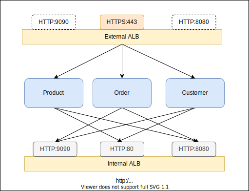

[](https://badge.fury.io/js/cdk-fargate-patterns)
[](https://badge.fury.io/py/cdk-fargate-patterns)
[](https://github.com/pahud/cdk-fargate-patterns/actions/workflows/release.yml)

# cdk-fargate-patterns

CDK patterns for serverless container with AWS Fargate

# `DualAlbFargateService`

Inspired by _Vijay Menon_ from the [AWS blog post](https://aws.amazon.com/blogs/containers/how-to-use-multiple-load-balancer-target-group-support-for-amazon-ecs-to-access-internal-and-external-service-endpoint-using-the-same-dns-name/) introduced in 2019, `DualAlbFargateService` allows you to create one or many fargate services with both internet-facing ALB and internal ALB associated with all services. With this pattern, fargate services will be allowed to intercommunicat via internal ALB while external inbound traffic will be spread across the same service tasks through internet-facing ALB.


The sample below will create 3 fargate services associated with both external and internal ALBs. The internal ALB will have an alias(`internal.svc.local`) auto-configured from Route 53 so services can communite through the private ALB endpoint.


```ts
new DualAlbFargateService(stack, 'Service', {
  spot: true, // FARGATE_SPOT only cluster
  tasks: [
    {
      task: orderTask,
      desiredCount: 2,
      internal: { port: 443, cert },
      external: { port: 80 },
      // customize the service autoscaling policy
      scalingPolicy: {
        maxCapacity: 20,
        requestPerTarget: 1000,
        targetCpuUtilization: 50,
      },
    },
    { task: customerTask, desiredCount: 2, internal: { port: 8080 } },
    { task: productTask, desiredCount: 2, internal: { port: 9090 } },
  ],
  route53Ops: {
    zoneName: 'svc.local',
    externalAlbRecordName: 'external',
    internalAlbRecordName: 'internal',
  },
});
```

## Fargate Spot Support

By enabling the `spot` property, 100% fargate spot tasks will be provisioned to help you save up to 70%. Check more details about [Fargate Spot](https://aws.amazon.com/about-aws/whats-new/2019/12/aws-launches-fargate-spot-save-up-to-70-for-fault-tolerant-applications/?nc1=h_ls). This is a handy catch-all flag to force all tasks to be `FARGATE_SPOT` only.

To specify mixed strategy with partial `FARGATE` and partial `FARGATE_SPOT`, specify the `capacityProviderStrategy` for individual tasks like

```ts
new DualAlbFargateService(stack, 'Service', {
  tasks: [
    {
      task: customerTask,
      internal: { port: 8080 },
      desiredCount: 2,
      capacityProviderStrategy: [
        {
          capacityProvider: 'FARGATE',
          base: 1,
          weight: 1,
        },
        {
          capacityProvider: 'FARGATE_SPOT',
          base: 0,
          weight: 3,
        },
      ],
    },
  ],
});
```
The custom capacity provider strategy will be applied if `capacityProviderStretegy` is specified, otherwise, 100% spot will be used when `spot: true`. The default policy is 100% Fargate on-demand.

## ECS Exec

Simply turn on the `enableExecuteCommand` property to enable the [ECS Exec](https://docs.aws.amazon.com/AmazonECS/latest/developerguide/ecs-exec.html) support for all services.

## Internal, External or Both

Specify the `internal` or `external` property to expose your service internally, externally or both.

The `cert` property implies `HTTPS` protocol.

```ts
new DualAlbFargateService(stack, 'Service', {
    tasks: [
      // this task is internal only
      { task: task1, internal: { port: 8080 } },
      // this task is external only
      { task: task2, external: { port: 8081 } },
      // this task is both external(HTTPS) and internal(HTTP) facing
      { 
        task: task3,
        external: { port: 443, cert: myAcmCert },
        internal: { port: 8888 },
      },
    ],
  });
```

## VPC Subnets

By default, all tasks will be deployed in the private subnets. You will need the NAT gateway for the default route associated with the private subnets to ensure the task can successfully pull the container images.

However, you are allowed to specify `vpcSubnets` to customize the subnet selection.

To deploy all tasks in public subnets, one per AZ:

```ts
new DualAlbFargateService(stack, 'Service', {
    vpcSubnets: {
      subnetType: ec2.SubnetType.PUBLIC,
      onePerAz: true,
  },
  ...
});
```
This will implicitly enable the `auto assign public IP` for each fargate task so the task can successfully pull the container images from external registry. However, the ingress traffic will still be balanced via the external ALB.

To deploy all tasks in specific subnets:

```ts
new DualAlbFargateService(stack, 'Service', {
  vpcSubnets: { 
      subnets: [
        ec2.Subnet.fromSubnetId(stack, 'sub-1a', 'subnet-0e9460dbcfc4cf6ee'),
        ec2.Subnet.fromSubnetId(stack, 'sub-1b', 'subnet-0562f666bdf5c29af'),
        ec2.Subnet.fromSubnetId(stack, 'sub-1c', 'subnet-00ab15c0022872f06'),
      ],
    },
  ...
});
```


## Sample Application

This repository comes with a sample applicaiton with 3 services in Golang. On deployment, the `Order` service will be exposed externally on external ALB port `80` and all requests to the `Order` service will trigger sub-requests internally to another other two services(`product` and `customer`) through the internal ALB and eventually aggregate the response back to the client.




## Deploy

To deploy the sample application in you default VPC:

```sh
// install first
$ yarn install
// compile the ts to js
$ yarn build
$ npx cdk --app lib/integ.default.js -c use_default_vpc=1 diff
$ npx cdk --app lib/integ.default.js -c use_default_vpc=1 deploy
```

To deploy with HTTPS-only with existing ACM certificate in your default VPC:

```sh
$ npx cdk --app lib/integ.default.js deploy -c use_default_vpc=1 -c ACM_CERT_ARN=<YOUR_ACM_CERT_ARN>
```

On deployment complete, you will see the external ALB endpoint in the CDK output. `cURL` the external HTTP endpoint and you should be able to see the aggregated response.


```sh
$ curl http://demo-Servi-EH1OINYDWDU9-1397122594.ap-northeast-1.elb.amazonaws.com
or
$ curl https://<YOUR_CUSTOM_DOMAIN_NAME>

{"service":"order", "version":"1.0"}
{"service":"product","version":"1.0"}
{"service":"customer","version":"1.0"}
```

# `WordPress`

Use the `WordPress` construct to create a serverless **WordPress** service with AWS Fargate, Amazon EFS filesystem and Aurora serverless database. All credentials auto generated from the **AWS Secret Manager** and securely inject the credentials into the serverless container with the auto generated IAM task execution role.

```ts
new WordPress(stack, 'WP', {
  auroraServerless: true,
  spot: true,
  enableExecuteCommand: true,
});
```

# `Laravel`

The `Laravl` construct is provided as a high-level abstraction that allows you to create a modern Laravel environment running on `AWS Fargate` and `Amazon Aurora Serverless`. Here comes two variants as the reference:

**laravel-bitnami** - based on [bitnami/laravel](https://hub.docker.com/r/bitnami/laravel/) with `artisan` running as the built-in web server.

**laravel-nginx-php-fpm** - laravel with nginx and php-fpm maintained by [Ernest Chiang](https://github.com/dwchiang).

Simply point `code` to your local Laravel codebase and it takes care everything else for you.

## Samples

```ts
/**
 * laravel-bitnami
 */
new Laravel(stack, 'LaravelBitnamiDemo', {
  auroraServerless: true,
  spot: true,
  enableExecuteCommand: true,
  code: path.join(__dirname, '../services/laravel-bitnami'),
  containerPort: 3000,
  loadbalancer: { port: 80 },
});

/**
 * laravel-nginx-php-fpm
 */
new Laravel(stack, 'LaravelNginxDemo', {
  auroraServerless: true,
  spot: true,
  enableExecuteCommand: true,
  code: path.join(__dirname, '../services/laravel-nginx-php-fpm'),
  loadbalancer: { port: 80 },
});
```

See [integ.laravel.ts](src/integ.laravel.ts) for the full code sample.
